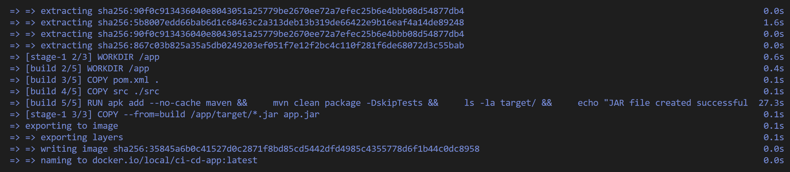
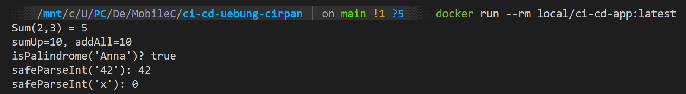
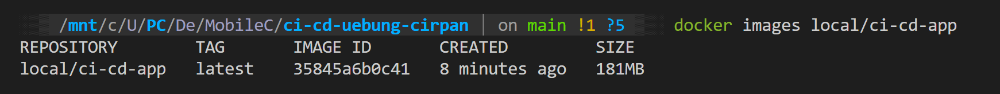

= CIC Submission 03 - Docker Integration
Emre Cirpan s2310237033 <s2310237033@fhooe.at>
:doctype: article
:toc-title: Inhalt
:srcdir: ./src
:icons: font
:toc: auto
:source-highlighter: highlight.js
:rouge-style: github

== 1. Dockerfile & .dockerignore erstellt

=== 1.1 Multi-Stage Dockerfile

Ein Multi-Stage Dockerfile wurde erstellt mit zwei Stages:

* **Build Stage**: Verwendet `eclipse-temurin:17-jdk-alpine` zum Kompilieren
** Kopiert `pom.xml` und `src/` Verzeichnis
** Führt `mvn clean package -DskipTests` aus
** Verifiziert, dass die JAR-Datei erstellt wurde mit `ls -la target/`

* **Runtime Stage**: Verwendet `eclipse-temurin:17-jre-alpine` (kleiner)
** Kopiert nur die JAR-Datei aus der Build-Stage
** Setzt ENTRYPOINT auf `java -jar app.jar`

[source,dockerfile]
----
# Multi-Stage Dockerfile for Java Maven Project
# Stage 1: Build
FROM eclipse-temurin:17-jdk-alpine AS build
WORKDIR /app

# Copy Maven files first for better caching
COPY pom.xml .
COPY src ./src

# Build the application and verify JAR exists
RUN apk add --no-cache maven && \
    mvn clean package -DskipTests && \
    ls -la target/ && \
    echo "JAR file created successfully"

# Stage 2: Runtime
FROM eclipse-temurin:17-jre-alpine
WORKDIR /app

# Copy the JAR from build stage
COPY --from=build /app/target/*.jar app.jar

# Expose port (if needed in future)
EXPOSE 8080

# Run the application
ENTRYPOINT ["java", "-jar", "app.jar"]
----

=== 1.2 .dockerignore

Die `.dockerignore` Datei reduziert den Build-Kontext und verbessert Cache-Treffer:

[source,text]
----
# Git files
.git
.gitignore

# Build artifacts
target/
*.class
*.jar

# IDE files
.vscode/
.idea/
*.iml

# OS files
.DS_Store
Thumbs.db

# Documentation
doc/
*.md
*.pdf

# CI/CD
.github/
----

=== 1.3 pom.xml angepasst

Die `pom.xml` wurde erweitert um das `maven-jar-plugin`, damit die Main-Class im Manifest eingetragen wird:

[source,xml]
----
<plugin>
  <groupId>org.apache.maven.plugins</groupId>
  <artifactId>maven-jar-plugin</artifactId>
  <version>3.3.0</version>
  <configuration>
    <archive>
      <manifest>
        <mainClass>com.example.cicd.App</mainClass>
      </manifest>
    </archive>
  </configuration>
</plugin>
----

== 2. Lokaler Docker Build & Test

=== 2.1 Docker Image bauen

Kommando zum Bauen des Images:

[source,bash]
----
docker build -t local/ci-cd-app:latest .
----

.Docker Build Output

_Screenshot des erfolgreichen Docker-Builds mit allen Stages und der Ausgabe "JAR file created successfully"_

=== 2.2 Docker Container starten

Kommando zum Starten des Containers:

[source,bash]
----
docker run --rm local/ci-cd-app:latest
----

.Docker Run Output

_Screenshot der Anwendungsausgabe im Container (Sum, sumUp, addAll, isPalindrome, safeParseInt)_

=== 2.3 Image-Größe prüfen

[source,bash]
----
docker images local/ci-cd-app
----

.Docker Images List

_Screenshot der Image-Liste mit Größenangabe (sollte durch Multi-Stage deutlich kleiner sein)_

== 3. GitHub Actions Integration

=== 3.1 Neuer Docker-Job

Ein neuer Job `docker-build` wurde zur Pipeline hinzugefügt:

* Läuft **nach** `build-test` (via `needs: build-test`)
* Nur auf `ubuntu-latest` (Single-Arch für `load: true`)
* Verwendet Docker Buildx
* Taggt Image mit Short-SHA: `local/ci-cd-app:${{ github.sha }}`
* Speichert Image als `.tar` Artifact

[source,yaml]
----
docker-build:
  needs: build-test
  runs-on: ubuntu-latest
  steps:
    - uses: actions/checkout@v4
    
    - name: Set up Docker Buildx
      uses: docker/setup-buildx-action@v3
    
    - name: Build Docker Image
      uses: docker/build-push-action@v5
      with:
        context: .
        load: true
        tags: local/ci-cd-app:${{ github.sha }}
    
    - name: Save Docker Image
      run: |
        docker save local/ci-cd-app:${{ github.sha }} -o docker-image-${{ github.sha }}.tar
        ls -lh docker-image-*.tar
    
    - name: Upload Docker Image Artifact
      uses: actions/upload-artifact@v4
      with:
        name: docker-image-${{ github.sha }}
        path: docker-image-${{ github.sha }}.tar
----

.GitHub Actions Workflow - Docker Build Job
image::images/image04.png[GitHub Actions workflow showing docker-build job, 800]

_Screenshot der GitHub Actions Pipeline mit dem neuen docker-build Job (grün/erfolgreich)_

=== 3.2 Workflow-Struktur

Die Pipeline hat jetzt folgende Struktur:

1. `hello` - Minimal-Test-Job
2. `build-test` - Matrix-Build (Ubuntu/Windows × Java 17/21) + SonarCloud
3. `docker-build` - Docker Image Build & Artifact Upload (needs: build-test)

.GitHub Actions Workflow Graph
image::images/image05.png[GitHub Actions workflow graph/visualization, 800]

_Screenshot der Workflow-Visualisierung mit allen drei Jobs und deren Abhängigkeiten_

== 4. Artifact Download & Lokale Ausführung

=== 4.1 Artifact herunterladen

.GitHub Actions Artifacts Page
image::images/image06.png[GitHub Actions artifacts page, 800]

_Screenshot der Artifacts-Seite mit dem docker-image-<sha>.tar Artifact_

=== 4.2 Image laden und ausführen

Kommandos zum Laden und Starten des heruntergeladenen Images:

[source,bash]
----
# Image aus .tar laden
docker load -i docker-image-<sha>.tar

# Geladene Images anzeigen
docker images local/ci-cd-app

# Container starten
docker run --rm local/ci-cd-app:<sha>
----

.Docker Load from Artifact
image::images/image07.png[Docker load output, 800]

_Screenshot des `docker load` Kommandos mit Ausgabe "Loaded image: local/ci-cd-app:<sha>"_

.Docker Run from Loaded Artifact
image::images/image08.png[Docker run output from loaded image, 800]

_Screenshot der Anwendungsausgabe beim Starten des aus dem Artifact geladenen Images_

== 5. Zusammenfassung

* ✅ Multi-Stage Dockerfile erstellt (Build + Runtime Stage)
* ✅ .dockerignore reduziert Build-Kontext
* ✅ Lokaler Build und Test erfolgreich
* ✅ CI-Job nach Build/Tests/Matrix/Sonar integriert
* ✅ Single-Arch Build mit `load: true`
* ✅ Image als Artifact (.tar) mit Short-SHA bereitgestellt
* ✅ Artifact heruntergeladen, geladen und lokal ausgeführt
* ✅ Reproduzierbarkeit durch SHA-Tags gewährleistet